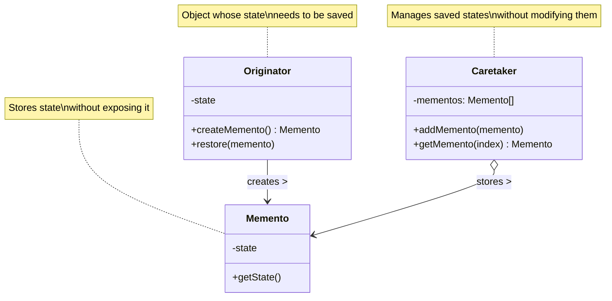
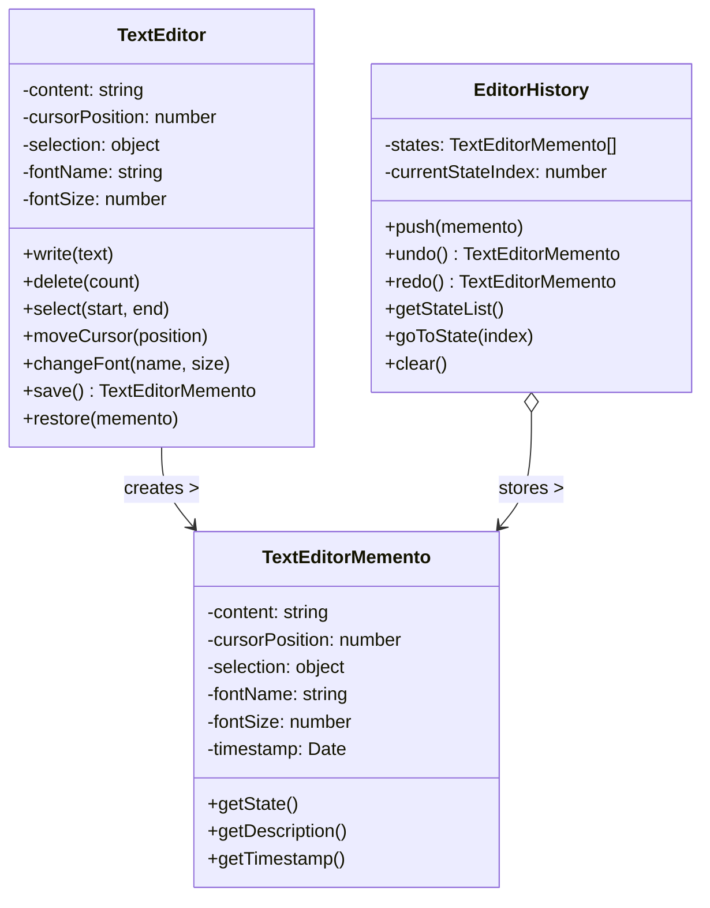

# Memento Design Pattern

## Problem Statement

How do you capture and externalize an object's internal state without violating encapsulation, so that the object can be restored to this state later? In many applications, you need to save snapshots of an object's state to implement features like undo/redo, history tracking, or save points. However, objects often have private or complex internal states that shouldn't be directly accessible to other objects.

## ELI5

Imagine you're playing a video game with save points. When you save your game, the game creates a special "save file" that remembers exactly where you were, what items you had, and what you had accomplished. Later, if you make a mistake or want to try a different approach, you can load that save file, and the game will go back to exactly how it was when you saved.

The Memento pattern works the same way: it lets an object (like your game character) create a "save file" (a memento) that stores its current state, without exposing the details of how that state is stored. Later, the object can use that memento to restore itself back to the saved state.

## Solution Overview

The Memento Design Pattern captures and externalizes an object's internal state without violating encapsulation, making it possible to restore the object to that state later. It involves three key components: the originator (the object whose state is saved), the memento (the saved state), and the caretaker (which keeps track of multiple mementos).

Key components of the pattern include:

1. **Originator**: The object whose state needs to be saved and restored
2. **Memento**: An object that stores a snapshot of the originator's internal state
3. **Caretaker**: Manages and stores mementos without modifying their content

### Flow Diagram

The following diagram in mermaid illustrates the Memento pattern:



In our text editor example, the structure looks like:



### Structure

1. **Originator**: The `TextEditor` class manages text content, cursor position, and formatting, providing methods to modify and display text. It can save its state to a memento and restore from a memento.

2. **Memento**: The `TextEditorMemento` class stores a snapshot of the text editor's state. It provides limited external access to prevent unauthorized changes, but allows the originator to retrieve the full state.

3. **Caretaker**: The `EditorHistory` class manages multiple memento objects, implementing undo and redo functionality without knowing or modifying the memento contents.

## Implementation Approach

### Flow

1. **Originator creates a memento** containing a snapshot of its current internal state
2. **Caretaker stores the memento** for later use
3. **When needed, the caretaker returns a memento** to the originator
4. **Originator uses the memento** to restore its previous state

### Key Components

#### Originator

```javascript
class TextEditor {
  constructor() {
    this.content = '';
    this.cursorPosition = 0;
    this.selection = { start: 0, end: 0 };
    this.fontName = 'Arial';
    this.fontSize = 12;
  }

  // Methods to modify state...

  /**
   * Save the current state to a memento object
   * @returns {TextEditorMemento} The saved state
   */
  save() {
    console.log('Saving editor state...');
    return new TextEditorMemento(
      this.content,
      this.cursorPosition,
      { ...this.selection },
      this.fontName,
      this.fontSize
    );
  }

  /**
   * Restore the state from a memento object
   * @param {TextEditorMemento} memento - The state to restore
   */
  restore(memento) {
    console.log('Restoring editor state...');
    const state = memento.getState();

    this.content = state.content;
    this.cursorPosition = state.cursorPosition;
    this.selection = { ...state.selection };
    this.fontName = state.fontName;
    this.fontSize = state.fontSize;
  }
}
```

#### Memento

```javascript
class TextEditorMemento {
  /**
   * Create a memento with the state of the TextEditor
   * @param {string} content - Text content
   * @param {number} cursorPosition - Cursor position
   * @param {Object} selection - Selection state
   * @param {string} fontName - Font name
   * @param {number} fontSize - Font size
   */
  constructor(content, cursorPosition, selection, fontName, fontSize) {
    this._content = content;
    this._cursorPosition = cursorPosition;
    this._selection = selection;
    this._fontName = fontName;
    this._fontSize = fontSize;
    this._timestamp = new Date();
  }

  /**
   * Return the state stored in the memento
   * Only the originator (TextEditor) should access this
   * @returns {Object} The stored state
   */
  getState() {
    return {
      content: this._content,
      cursorPosition: this._cursorPosition,
      selection: this._selection,
      fontName: this._fontName,
      fontSize: this._fontSize,
    };
  }

  /**
   * Get a description of this memento
   * @returns {string} Memento description
   */
  getDescription() {
    const dateStr = this._timestamp.toLocaleTimeString();
    return `${dateStr} - ${this._content.substring(0, 15)}${
      this._content.length > 15 ? '...' : ''
    }`;
  }
}
```

#### Caretaker

```javascript
class EditorHistory {
  constructor() {
    this.states = [];
    this.currentStateIndex = -1;
  }

  /**
   * Add a memento to the history
   * @param {TextEditorMemento} memento - The memento to store
   */
  push(memento) {
    // If we did some new actions after undoing, clear the "future" states
    if (this.currentStateIndex < this.states.length - 1) {
      this.states = this.states.slice(0, this.currentStateIndex + 1);
    }

    this.states.push(memento);
    this.currentStateIndex = this.states.length - 1;
  }

  /**
   * Get the previous state (for undo)
   * @returns {TextEditorMemento|null} The previous state or null
   */
  undo() {
    if (this.currentStateIndex > 0) {
      this.currentStateIndex--;
      return this.states[this.currentStateIndex];
    }
    return null;
  }

  /**
   * Get the next state (for redo)
   * @returns {TextEditorMemento|null} The next state or null
   */
  redo() {
    if (this.currentStateIndex < this.states.length - 1) {
      this.currentStateIndex++;
      return this.states[this.currentStateIndex];
    }
    return null;
  }
}
```

## Considerations

### Performance Implications

- Creating and storing mementos can be memory-intensive for large states
- Consider implementing incremental state changes instead of full snapshots
- For large objects, implement lazy copying or flyweight sharing
- Be mindful of how many states you store in the caretaker

### Design Flexibility

- Allows saving and restoring state without violating encapsulation
- Can be extended to support multiple types of snapshots
- Can be combined with Command pattern for more complex undo/redo systems
- Supports various storage strategies (in-memory, persistent, incremental)

### Implementation Challenges

- Deciding what state to include in the memento
- Managing memory usage when storing many mementos
- Handling objects with references to other objects
- Dealing with external resources that can't be easily serialized

## When to Use

- When you need to implement undo/redo functionality
- When you need to create snapshots of an object's state
- When direct interface to obtain state would expose implementation details
- When you need to roll back state after failed operations
- When you want to implement save points or checkpoints in an application

## When Not to Use

- When saving and restoring state is simple and doesn't require encapsulation
- When the state is small and can be easily passed as parameters
- When performance or memory constraints make storing states impractical
- When the object's state rarely changes or doesn't need to be restored
- When command logging or event sourcing is a more appropriate approach

## Related Patterns or Examples

- **Command Pattern**: Often used with Memento to implement undo/redo operations
- **Iterator Pattern**: Provides a way to access elements in the caretaker's collection
- **Prototype Pattern**: An alternative for creating copies of objects
- **Snapshot Pattern**: A variation focused on application-wide state snapshots
- **State Pattern**: Manages state transitions between different object states
