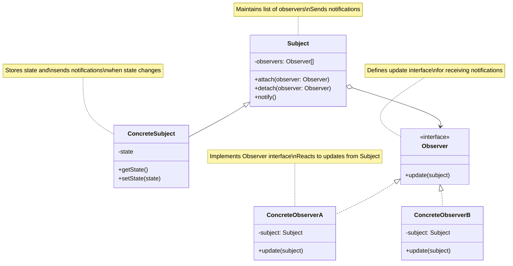
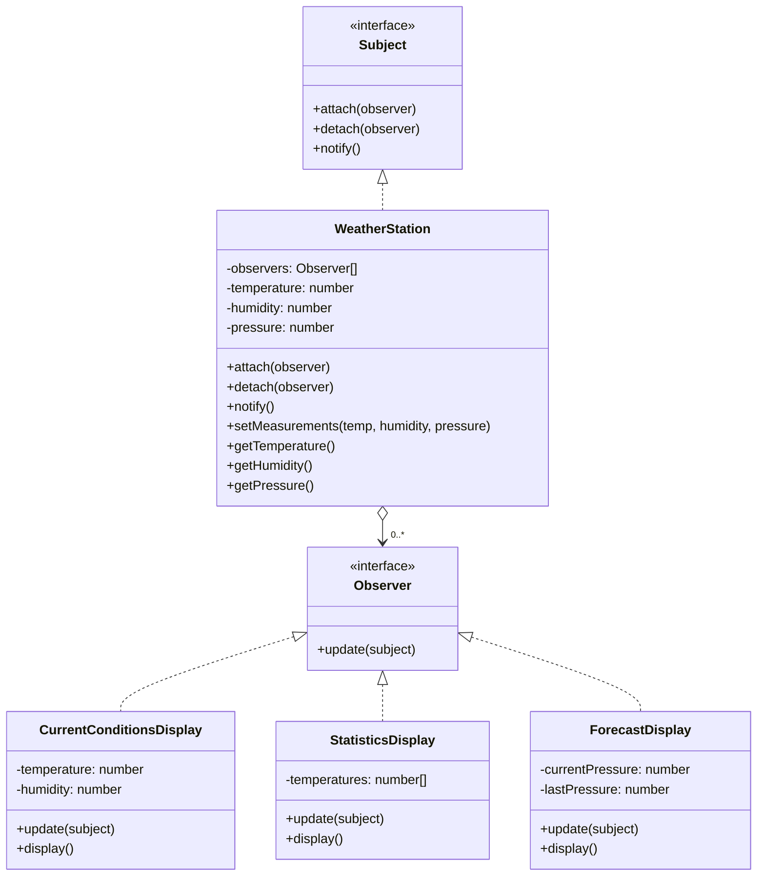

# Observer Design Pattern

## Problem Statement

How do you maintain consistency between related objects without making them tightly coupled? When one object changes state, how do you notify and update all dependent objects automatically? This problem often arises in systems where a change in one object requires changing others, but you don't want the objects to be tightly coupled to each other.

## ELI5

Imagine you subscribe to a newspaper. You don't call the newspaper every day to check if there's a new edition - instead, the newspaper company keeps a list of all subscribers and delivers the paper to them whenever a new edition is published.

The Observer pattern works the same way: some objects (the subscribers or "observers") are interested in what happens to another object (the "subject"). Instead of the observers constantly checking the subject's state, the subject keeps a list of observers and notifies them automatically whenever its state changes.

## Solution Overview

The Observer Design Pattern defines a one-to-many dependency between objects so that when one object changes state, all its dependents are notified and updated automatically. It involves a subject that maintains a list of its dependents, called observers, and notifies them automatically of any state changes, usually by calling one of their methods.

Key components of the pattern include:

1. **Subject**: Knows its observers and provides an interface for attaching and detaching observers
2. **Observer**: Defines an interface for objects that should be notified of changes in a subject
3. **Concrete Subject**: Stores state of interest to observers and sends notifications
4. **Concrete Observer**: Maintains a reference to a subject and implements the observer interface

### Flow Diagram

The following diagram in mermaid illustrates the Observer pattern:



In our weather monitoring example, the structure looks like:



### Structure

1. **Subject**: The `Subject` interface declares methods for attaching, detaching, and notifying observers.

2. **Concrete Subject**: The `WeatherStation` class maintains a list of observers and notifies them when its state changes.

3. **Observer**: The `Observer` interface declares the `update` method, which is called by subjects when their state changes.

4. **Concrete Observers**: Classes like `CurrentConditionsDisplay`, `StatisticsDisplay`, and `ForecastDisplay` implement the Observer interface and define actions to take when notified of changes.

## Implementation Approach

### Flow

1. **Subject maintains a list of observers** and provides methods to add and remove observers
2. **When the subject's state changes**, it notifies all registered observers
3. **Each observer implements the update method**, which is called by the subject
4. **Observers query the subject** to get updated state information
5. **Observers perform actions** based on the updated state

### Key Components

#### Subject Interface

```javascript
class Subject {
  /**
   * Attach an observer to the subject
   * @param {Observer} observer - The observer to attach
   */
  attach(observer) {
    throw new Error('attach method must be implemented by concrete classes');
  }

  /**
   * Detach an observer from the subject
   * @param {Observer} observer - The observer to detach
   */
  detach(observer) {
    throw new Error('detach method must be implemented by concrete classes');
  }

  /**
   * Notify all observers about state changes
   */
  notify() {
    throw new Error('notify method must be implemented by concrete classes');
  }
}
```

#### Concrete Subject Implementation

```javascript
class WeatherStation extends Subject {
  constructor() {
    super();
    this.observers = [];
    this.temperature = 0;
    this.humidity = 0;
    this.pressure = 0;
  }

  attach(observer) {
    const isExist = this.observers.includes(observer);
    if (isExist) {
      console.log('WeatherStation: Observer has been attached already.');
      return;
    }

    this.observers.push(observer);
    console.log('WeatherStation: Attached an observer.');
  }

  detach(observer) {
    const observerIndex = this.observers.indexOf(observer);
    if (observerIndex === -1) {
      console.log('WeatherStation: Nonexistent observer.');
      return;
    }

    this.observers.splice(observerIndex, 1);
    console.log('WeatherStation: Detached an observer.');
  }

  notify() {
    console.log('WeatherStation: Notifying observers...');
    for (const observer of this.observers) {
      observer.update(this);
    }
  }

  // Business logic and state management
  setMeasurements(temperature, humidity, pressure) {
    this.temperature = temperature;
    this.humidity = humidity;
    this.pressure = pressure;

    this.notify();
  }

  // Getters for state
  getTemperature() {
    return this.temperature;
  }
}
```

#### Observer Interface

```javascript
class Observer {
  /**
   * Receive update from subject
   * @param {Subject} subject - The subject that triggered the update
   */
  update(subject) {
    throw new Error('update method must be implemented by concrete classes');
  }
}
```

#### Concrete Observer Implementation

```javascript
class CurrentConditionsDisplay extends Observer {
  constructor() {
    super();
    this.temperature = 0;
    this.humidity = 0;
  }

  update(subject) {
    if (subject instanceof WeatherStation) {
      this.temperature = subject.getTemperature();
      this.humidity = subject.getHumidity();
      this.display();
    }
  }

  display() {
    console.log(
      `Current conditions: ${this.temperature.toFixed(1)}°C and ${this.humidity.toFixed(
        1
      )}% humidity`
    );
  }
}
```

## Considerations

### Performance Implications

- Notification can be expensive when there are many observers
- The update logic in observers should be lightweight to avoid blocking
- Consider batch updates if there are frequent state changes
- May need to implement change tracking to avoid unnecessary updates

### Design Flexibility

- Loose coupling between subjects and observers
- Observers can be added and removed dynamically at runtime
- Support for broadcast communication
- Observers can observe multiple subjects

### Implementation Challenges

- Managing notification order when updates have dependencies
- Ensuring that cyclic updates don't cause infinite loops
- Handling updates when observers are being added or removed during notification
- Memory leaks if observers aren't properly detached

## When to Use

- When a change to one object requires changing others, and you don't know how many objects need to be changed
- When an object should be able to notify other objects without making assumptions about what those objects are
- When you need to maintain consistency between related objects without making them tightly coupled
- When a framework or library's core components need to notify application-specific components
- When the subject and observers need to be reused independently

## When Not to Use

- When the notification logic is simple and doesn't change
- When the observer relationship is static and known at compile time
- When changes rarely occur or affect only a few objects
- When the coupling between subject and observers isn't an issue
- When notification would create complex dependencies or cyclic references

## Related Patterns or Examples

- **Mediator Pattern**: While Observer distributes communication by introducing subject and observer objects, Mediator centralizes communication between objects
- **Publish-Subscribe Pattern**: A variation of Observer where the subject sends messages to a channel, which subscribers listen to
- **Event Bus**: A centralized mechanism for event handling, often built on the Observer pattern
- **Model-View-Controller (MVC)**: Uses Observer to update views when the model changes
- **Reactive Programming**: Modern approach to the Observer pattern, focusing on data streams and propagation of changes

```

```
