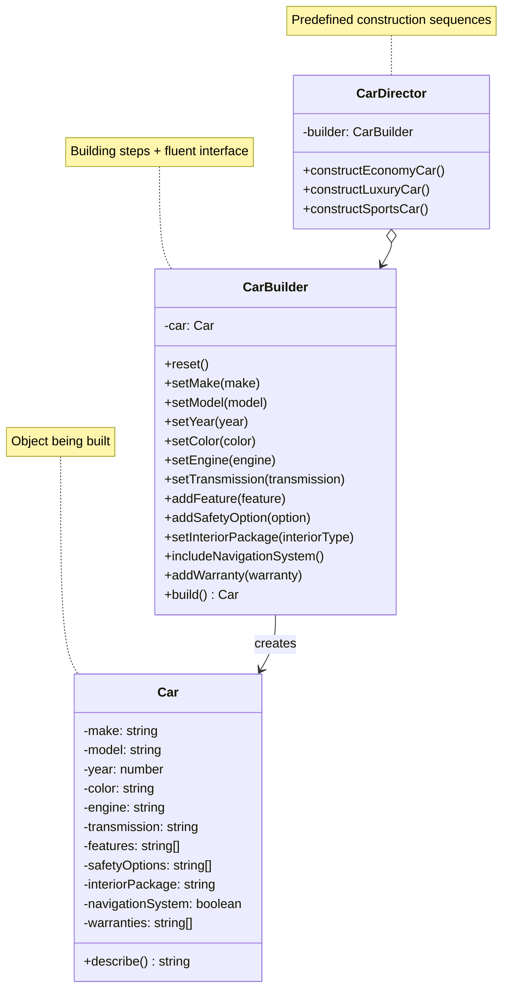
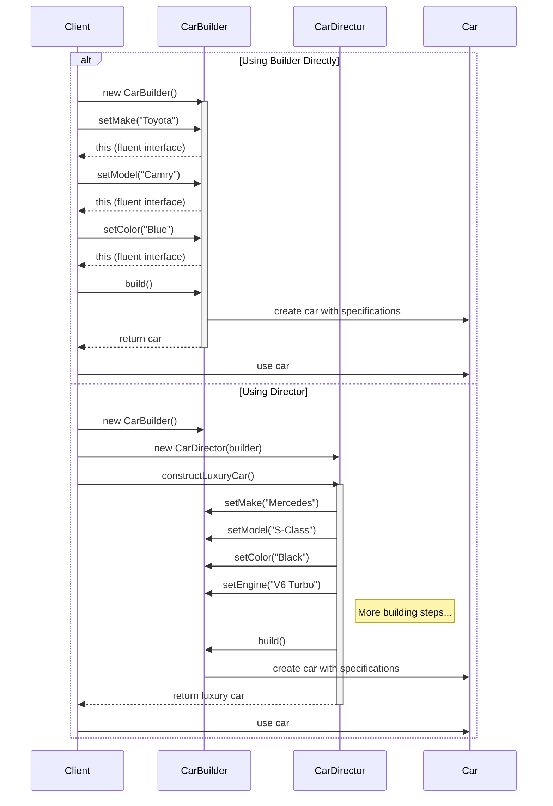

# Builder Design Pattern

## Problem Statement

How do you construct a complex object step by step, and how can you represent the same construction process to create different representations? In many applications, object creation can involve numerous parameters, some optional, some required, with complex interdependencies. Traditional constructors with many parameters become unwieldy and error-prone, especially when some parameters are optional or have default values.

## ELI5

Imagine you're ordering a custom car. Instead of telling the salesperson everything at once (which would be overwhelming), you go through a step-by-step process: first you pick the model, then the color, then the engine, then the interior, and so on. You can skip some options if you don't care about them (like heated seats), and at the end, you get a car built exactly to your specifications.

The Builder pattern works the same way: instead of creating an object with one giant instruction that includes all parameters, you build it step by step, with each step being optional, until you have a complete object.

## Solution Overview

The Builder Design Pattern is a creational pattern that separates the construction of a complex object from its representation. It allows you to create complex objects step by step and produce different types and representations of an object using the same construction code.

Key components of the pattern include:

1. **Product**: The complex object being built (Car)
2. **Builder**: An interface that defines steps to build the product (CarBuilder)
3. **Director** (optional): A class that defines pre-made construction sequences (CarDirector)

### Flow Diagram

The following diagram in mermaid illustrates the Builder pattern:



The construction process with the builder pattern:



### Structure

1. **Builder Pattern Components:**

   - **Product (Car)**: The complex object to be built
   - **Builder (CarBuilder)**: Class with methods to build and assemble parts of the car
   - **Director (CarDirector)**: Defines predefined construction sequences for specific car types
   - **Client**: Uses the builder directly or through a director to create cars

2. **Building Block Approach:**
   - Each builder method represents setting a specific attribute or adding a specific feature
   - Builder methods return `this` to allow method chaining (fluent interface)
   - The final `build()` method returns the complete constructed car

## Implementation Approach

### Flow

1. **Client creates a builder** (or gets one from a director)
2. **Client calls builder methods** to configure the car's parameters
   - Sets required attributes (make, model, year)
   - Adds optional features (navigation, safety options, warranties)
3. **Client calls build()** to generate the final object
4. **Builder creates and returns** the constructed car
5. **Builder resets itself** to be ready for a new construction

### Key Components

#### Car (Product)

```javascript
class Car {
  constructor() {
    this.make = '';
    this.model = '';
    this.year = 0;
    this.color = '';
    this.engine = '';
    this.transmission = '';
    this.features = [];
    this.safetyOptions = [];
    this.interiorPackage = '';
    this.navigationSystem = false;
    this.warranties = [];
  }

  describe() {
    // Returns a string description of the car
  }
}
```

#### CarBuilder (Builder)

```javascript
class CarBuilder {
  constructor() {
    this.reset();
  }

  reset() {
    this.car = new Car();
    return this;
  }

  setMake(make) {
    this.car.make = make;
    return this;
  }

  // More builder methods...

  build() {
    const car = this.car;
    this.reset();
    return car;
  }
}
```

#### CarDirector (Director)

```javascript
class CarDirector {
  constructor(builder) {
    this.builder = builder;
  }

  constructEconomyCar() {
    return (
      this.builder
        .setMake('Honda')
        .setModel('Civic')
        // More building steps...
        .build()
    );
  }

  // More predefined car configurations...
}
```

## Considerations

### Performance Implications

- Builders add a level of indirection and additional objects, which has a small memory overhead
- For very simple objects, direct construction may be more efficient
- The pattern can improve performance by reusing the builder for multiple objects

### Maintainability

- Separates construction code from the product's business logic
- Makes it easy to add new attributes or features to the car without changing existing code
- Provides clear, readable client code that shows exactly what attributes are being set

### Complexity Trade-offs

- Adds more code and classes compared to simple constructors
- Improves code readability and makes invalid state configurations harder to create
- Helps ensure all required parameters are set before building

## When to Use

- When object construction involves many steps or parameters
- When you need to create different representations of the same product (economy car, luxury car, sports car)
- When you want to create immutable objects without excessive constructor parameters
- When object construction has complex validation or requires specific step sequences
- When you want to prevent the creation of partially initialized objects

## When Not to Use

- For simple objects with few parameters where constructors or factory methods are sufficient
- When objects don't have many optional parameters
- When object construction doesn't have multiple steps
- When performance is absolutely critical and the overhead of additional objects is a concern

## Related Patterns or Examples

- **Factory Pattern**: Builders focus on step-by-step construction, while Factories focus on which class to instantiate
- **Fluent Interface**: Often used with Builder to create readable method chaining
- **Composite Pattern**: Builders can help construct complex composite structures
- **Prototype Pattern**: Can be used with Builder when you need to clone and customize objects
