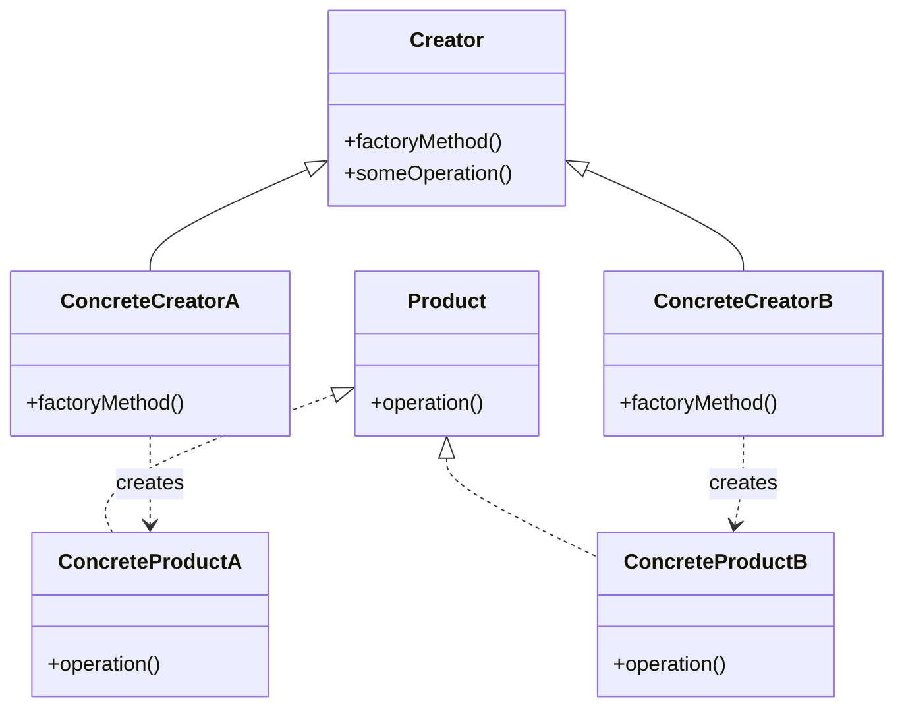
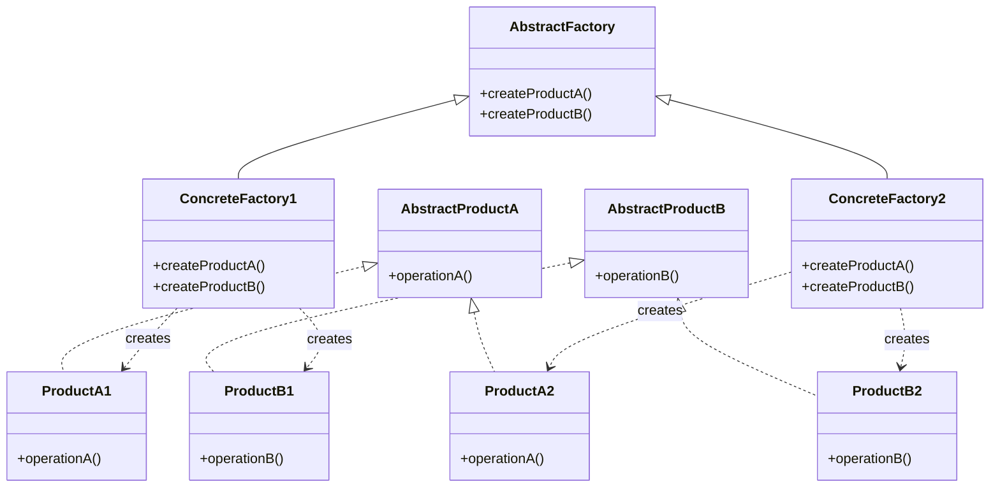

# Factory Design Pattern

## Problem Statement

How do you create objects without specifying the exact class to instantiate, and how can you decouple object creation from the code that depends on these objects? In many applications, object creation logic can become complex, scattered throughout the codebase, or tightly coupled to specific implementations, making the system rigid and difficult to modify.

## ELI5

Imagine you're ordering a vehicle at a dealership. You don't need to know how to build the car - you just tell the salesperson what type of vehicle you want (a sedan, SUV, or truck). The dealership handles all the complicated details of creating the right kind of vehicle for you.

In programming, the Factory pattern works the same way. Your code simply asks for "a document" or "a button," and the factory creates the specific kind you need (like a text document or a Windows button). This way, your code doesn't need to know all the details about how each specific object is made.

## Solution Overview

The Factory Design Pattern is a creational pattern that provides interfaces for creating objects without specifying their concrete classes. It encapsulates the instantiation logic and makes it easier to change the types of objects created as requirements evolve.

There are three main variations of the Factory pattern:

1. **Simple Factory**: A basic class that creates and returns objects based on a parameter
2. **Factory Method**: Defines an interface for creating objects but lets subclasses decide which classes to instantiate
3. **Abstract Factory**: Provides an interface for creating families of related objects

### Flow Diagram

The following diagram in mermaid illustrates the Factory Method pattern:



For the Abstract Factory pattern:



### Structure

1. **Simple Factory Pattern:**
   - Factory: Central class that creates products based on parameters
   - Products: The different objects the factory can create

2. **Factory Method Pattern:**
   - Creator: Abstract class declaring the factory method
   - Concrete Creators: Subclasses implementing the factory method
   - Product: Interface for the objects the factory method creates
   - Concrete Products: Specific implementations of the product interface

3. **Abstract Factory Pattern:**
   - Abstract Factory: Interface declaring creation methods for each product
   - Concrete Factories: Implementations of the abstract factory
   - Abstract Products: Interfaces for the product families
   - Concrete Products: Implementations of the abstract products

## Implementation Approach

### Flow

1. **Simple Factory**:
   - Client requests an object from the factory
   - Factory instantiates the appropriate concrete class
   - Factory returns the created object to the client

2. **Factory Method**:
   - Client works with products through the creator interface
   - Creator's subclass overrides the factory method
   - Creator's methods use the factory method to get products

3. **Abstract Factory**:
   - Client receives a specific factory implementation
   - Client uses factory to create product objects
   - Client works with products through their abstract interfaces

### Key Components

**Simple Factory:**
```javascript
class UserFactory {
  createUser(type, data) {
    switch(type) {
      case 'admin':
        return new AdminUser(data);
      case 'customer':
        return new CustomerUser(data);
      default:
        throw new Error(`User type ${type} not recognized.`);
    }
  }
}
```

**Factory Method:**
```javascript
class Application {
  // Factory method
  createDocument(name) {
    throw new Error('Factory method must be implemented by subclasses');
  }
  
  // Business logic using the factory method
  openDocument(name) {
    const document = this.createDocument(name);
    return document.open();
  }
}

class TextEditor extends Application {
  createDocument(name) {
    return new TextDocument(name);
  }
}
```

**Abstract Factory:**
```javascript
class UIFactory {
  createButton() {
    throw new Error('Method not implemented');
  }
  createCheckbox() {
    throw new Error('Method not implemented');
  }
}

class WindowsUIFactory extends UIFactory {
  createButton() {
    return new WindowsButton();
  }
  createCheckbox() {
    return new WindowsCheckbox();
  }
}
```

## Considerations

### Performance Implications
- Factories add a level of indirection, which may have slight performance overhead
- For simple object creation, direct instantiation might be more efficient
- The benefits of flexibility usually outweigh the minimal performance cost

### Maintainability
- Centralizes object creation, making it easier to change implementation details
- Encapsulates creation logic, reducing duplication throughout the codebase
- New product types may require changes to factory classes (violating Open/Closed Principle unless carefully designed)

### Complexity
- Simple Factory is straightforward but less flexible
- Factory Method adds more complexity but allows extension through inheritance
- Abstract Factory provides the most flexibility but has the highest complexity

## When to Use

- When a system should be independent of how its products are created and composed
- When you want to provide a library of products without exposing implementation details
- When creating objects with complex construction logic
- When object creation should vary by environment, configuration, or application state
- When you need to work with multiple families of related products

## When Not to Use

- When adding new products requires changing every existing factory
- When object creation is simple and unlikely to change
- When the creation logic doesn't need to be isolated
- When performance is critical and the additional abstraction impacts performance
- When the flexibility provided by factories isn't needed

## Related Patterns or Examples

- **Builder Pattern**: Used when object construction is complex with many optional parameters
- **Prototype Pattern**: Creates new objects by copying existing objects
- **Singleton Pattern**: Often combined with Factory to ensure one factory instance
- **Dependency Injection**: Modern alternative that addresses similar concerns
- **Strategy Pattern**: Often used with factories to create different strategy implementations
- **Template Method Pattern**: Factory Method is a specialization of Template Method