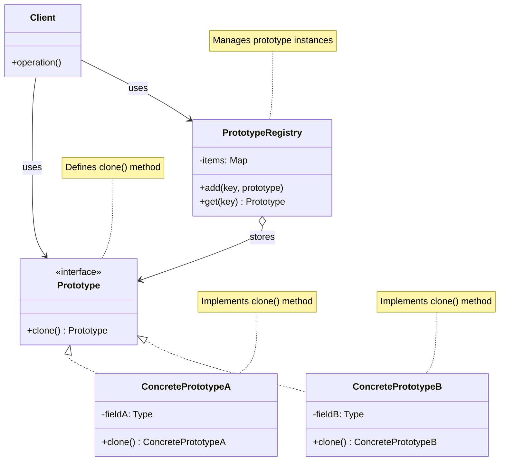
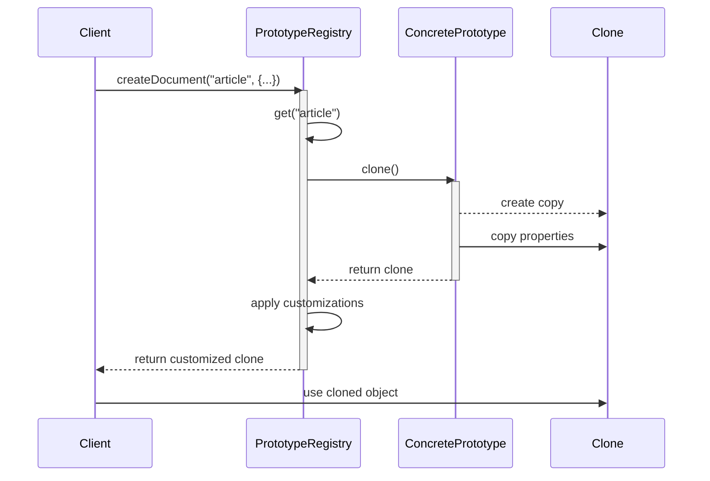

# Prototype Design Pattern

## Problem Statement

How do you create new objects based on existing ones, while avoiding the complexity of direct instantiation and reducing the number of classes needed? In many applications, creating objects from scratch can be expensive or complex, especially when the initialization involves expensive resources, complex computations, or external dependencies.

## ELI5

Imagine you have a perfect drawing of a house. Instead of drawing a new house from scratch every time, you make a photocopy of your original drawing and then add or change details on the copy. This way, you save time and ensure all your houses start with the same basic design.

The Prototype pattern works the same way: you create a perfect "original" object, and when you need more objects like it, you just make copies of the original and modify them as needed. This is much faster than creating each object from scratch.

## Solution Overview

The Prototype Design Pattern creates new objects by copying existing ones, known as prototypes, instead of creating them from scratch using constructors. It allows you to produce new instances by cloning existing ones, preserving their state while allowing customization.

Key components of the pattern include:

1. **Prototype Interface**: Declares the cloning method
2. **Concrete Prototype**: Implements the cloning method
3. **Client**: Creates new objects by asking a prototype to clone itself
4. **Prototype Registry** (optional): Maintains a collection of frequently used prototypes

### Flow Diagram

The following diagram in mermaid illustrates the Prototype pattern:



The cloning process with the registry:



### Structure

1. **Prototype Pattern Components:**

   - **Prototype (base class)**: Declares the interface for cloning itself
   - **Concrete Prototype**: Implements the cloning operation
   - **Client**: Creates new objects by asking prototypes to clone themselves
   - **Prototype Registry** (optional): Stores and manages frequently used prototypes

2. **Cloning Approach:**
   - **Shallow Clone**: Copies the object's properties directly (works for primitive values)
   - **Deep Clone**: Recursively copies nested objects and arrays
   - **Mixed Approach**: Shallow copies most properties but deep copies specific complex structures

## Implementation Approach

### Flow

1. **Create prototype objects** with initial, shared state
2. **Register prototypes** in a registry (optional)
3. **Clone prototypes** when new objects are needed
4. **Customize clones** with specific attributes
5. **Use cloned objects** in the application

### Key Components

#### Prototype Base Class

```javascript
class Prototype {
  clone() {
    // Default shallow clone implementation
    const clone = Object.create(Object.getPrototypeOf(this));
    const propNames = Object.getOwnPropertyNames(this);

    propNames.forEach((name) => {
      const desc = Object.getOwnPropertyDescriptor(this, name);
      Object.defineProperty(clone, name, desc);
    });

    return clone;
  }
}
```

#### Concrete Prototype Implementation

```javascript
class Document extends Prototype {
  constructor(title, content, author, tags = [], metadata = {}) {
    super();
    this.title = title;
    this.content = content;
    this.author = author;
    this.tags = tags;
    this.metadata = metadata;
    this.createdAt = new Date();
    this.updatedAt = new Date();
  }

  // Custom deep clone implementation
  clone() {
    // First get a shallow clone from the parent class
    const clone = super.clone();

    // Deep clone arrays and objects
    clone.tags = [...this.tags];
    clone.metadata = JSON.parse(JSON.stringify(this.metadata));

    // Update the clone's timestamps
    clone.createdAt = new Date();
    clone.updatedAt = new Date();

    return clone;
  }

  // Other document methods...
}
```

#### Prototype Registry

```javascript
class DocumentRegistry {
  constructor() {
    this.documents = {};
  }

  registerDocument(key, document) {
    this.documents[key] = document;
  }

  createDocument(key, customizations = {}) {
    const prototype = this.documents[key];

    if (!prototype) {
      throw new Error(`Document type "${key}" doesn't exist in the registry.`);
    }

    const clonedDocument = prototype.clone();

    // Apply customizations to the cloned document
    Object.keys(customizations).forEach((prop) => {
      // Apply customizations...
    });

    return clonedDocument;
  }
}
```

## Considerations

### Performance Implications

- Cloning is generally faster than creating objects from scratch, especially for complex initialization
- Deep cloning of large object graphs can be expensive
- For simple objects, regular construction might be more efficient than prototyping

### Maintainability

- Reduces the number of constructor parameters and subclasses
- Centralizes object initialization in prototype objects
- Makes it easy to add new variants by registering new prototypes

### Cloning Complexity

- Shallow cloning is simple but may lead to shared references issues
- Deep cloning requires custom implementation for complex object structures
- Circular references need special handling during cloning

## When to Use

- When creating objects is more expensive than copying existing ones
- When your code shouldn't depend on the concrete classes of objects to be created
- When you need to create objects with various configurations that share a common base
- When you want to reduce the number of subclasses
- When objects have multiple possible initial states but share a common structure

## When Not to Use

- When object construction is simple and inexpensive
- When deep copying complex objects creates performance issues
- When you need to maintain unique identity for each object
- When the number of object variations is small and fixed

## Related Patterns or Examples

- **Factory Pattern**: Prototype can be used inside Factory methods to create objects
- **Composite Pattern**: Prototype can be used to clone complex object structures
- **Memento Pattern**: Can work with Prototype to restore object states
- **Command Pattern**: Prototypes can be used to create copies of commands for undo/redo
- **Builder Pattern**: Prototypes can initialize builders with common configurations
