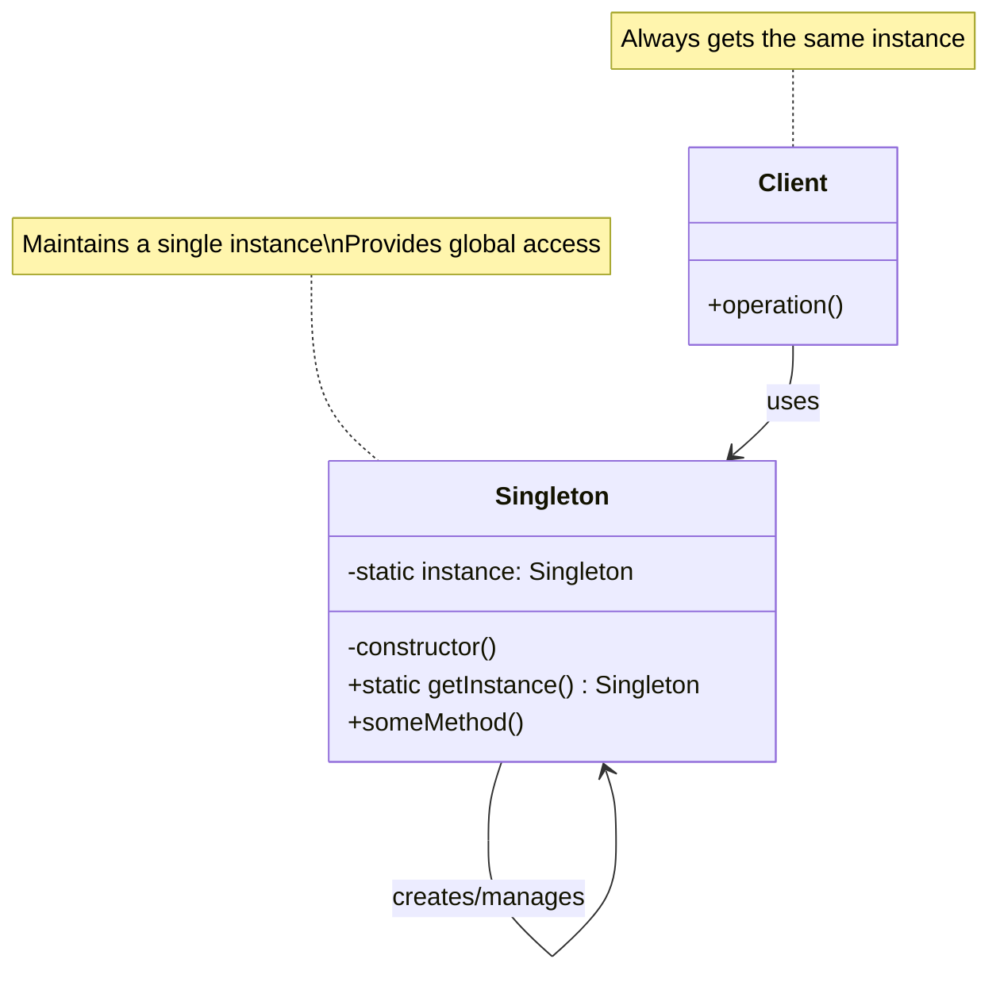
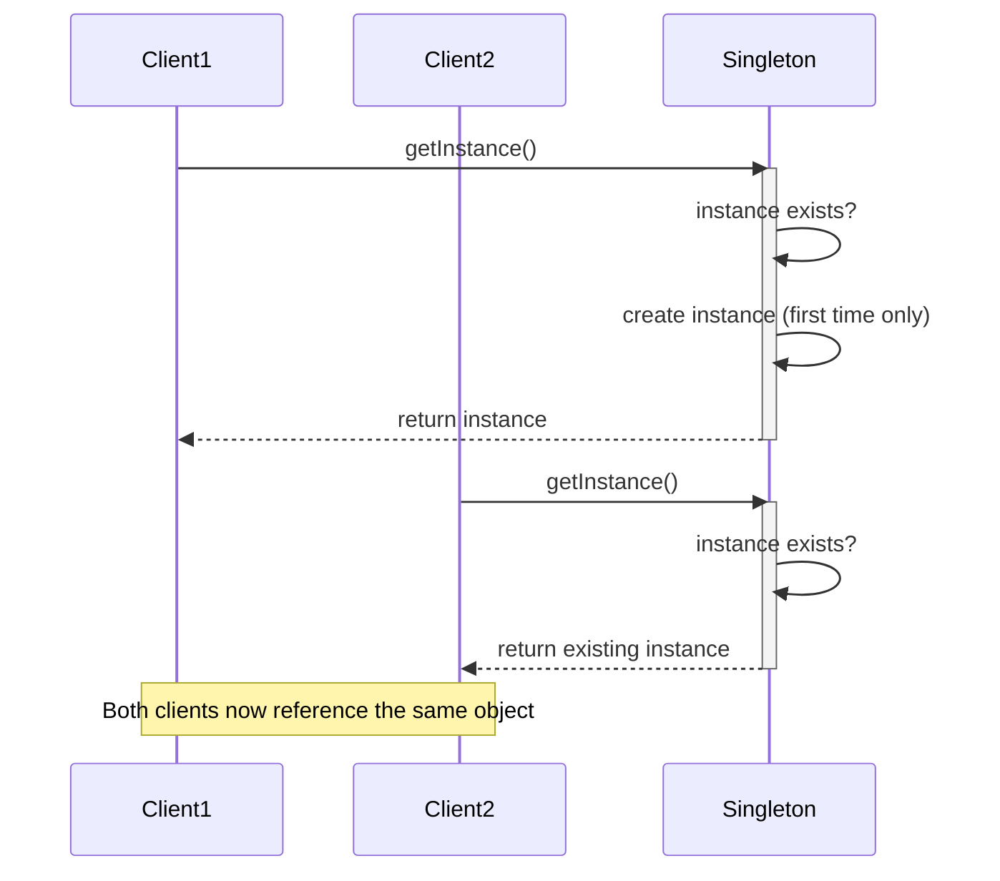

# Singleton Design Pattern

## Problem Statement

How do you ensure a class has only one instance and provide a global point of access to it? In many applications, there are components that should be instantiated only once - for example, a database connection, a logger, or a configuration manager. Creating multiple instances might waste system resources or lead to inconsistent states.

## ELI5

Imagine you're the president of a country. There can only be one president at a time, and everyone in the country needs to talk to the same president - not different presidents. So, no matter who asks "Who is the president?", they should always get the same answer.

The Singleton pattern works like that: it makes sure that no matter how many times your program asks for an object, it always gets the exact same one - not different copies of it.

## Solution Overview

The Singleton Design Pattern ensures a class has only one instance and provides a global point of access to it. It involves a class that is responsible for creating and maintaining its own unique instance, preventing any other part of the system from creating additional instances.

Key components of the pattern include:

1. **Private Constructor**: Prevents direct instantiation from outside the class
2. **Static Instance**: A class variable that holds the single instance
3. **Static Access Method**: Provides global access to the singleton instance

### Flow Diagram

The following diagram in mermaid illustrates the Singleton pattern:



The instantiation flow:



### Structure

1. **Singleton Pattern Components:**

   - **Singleton Class**: A class designed to have only one instance
   - **Static Instance Field**: Holds the single instance of the class
   - **Private/Protected Constructor**: Prevents external instantiation
   - **Static Access Method**: Returns the single instance

2. **Implementation Variations:**
   - **Eager Initialization**: Instance created when class is loaded
   - **Lazy Initialization**: Instance created when first requested
   - **Thread-Safe Initialization**: Ensures only one instance in concurrent environments

## Implementation Approach

### Flow

1. **Client requests an instance** through the static method
2. **Singleton checks if instance already exists**
3. **If no instance exists**, the Singleton creates one
4. **If an instance already exists**, the Singleton returns the existing instance
5. **Client uses the instance**, guaranteed to be the same instance used by all clients

### Key Components

#### Singleton Class with Lazy Initialization

```javascript
class Singleton {
  // Static property to hold the single instance
  static instance = undefined;

  // Constructor (should be private in languages that support it)
  constructor() {
    if (Singleton.instance) {
      throw new Error('Singleton instance already exists. Use getInstance() instead.');
    }
  }

  // Static method to get the instance
  static getInstance() {
    if (!Singleton.instance) {
      Singleton.instance = new Singleton();
    }
    return Singleton.instance;
  }

  // Example business method
  someMethod() {
    console.log('Method called on singleton instance');
  }
}
```

#### Client Code Usage

```javascript
// Client code
function clientCode() {
  const singleton1 = Singleton.getInstance();
  const singleton2 = Singleton.getInstance();

  // Both variables reference the same object
  console.log(singleton1 === singleton2); // true

  // Use the singleton
  singleton1.someMethod();
}
```

## Considerations

### Performance Implications

- Reduces memory usage by ensuring only one instance exists
- Lazy initialization can improve startup performance
- May introduce contention points in concurrent systems

### Maintainability

- Provides a clear, well-defined access point to shared resources
- Can create hidden dependencies and make testing more difficult
- May result in global state that's harder to manage and reason about

### Global State Considerations

- Singletons effectively create global state, which can make code harder to test
- Can make it difficult to isolate components during unit testing
- May make it harder to track the flow of data in a large application

## When to Use

- When exactly one instance of a class is needed throughout the application
- When you need stricter control over global variables
- For shared resources like connection pools, thread pools, caches, or dialog boxes
- For services that need to be coordinated across the system, like a logging service
- When the instance must be extensible by subclassing but clients should use the same instance

## When Not to Use

- When the single instance constraint is not actually required
- When global state would add unnecessary complexity
- When it makes unit testing significantly more difficult
- When you need multiple instances with different configurations
- When you want to follow functional programming principles that avoid shared state

## Related Patterns or Examples

- **Factory Method**: Can be used to create a Singleton instance
- **Facade Pattern**: Often implemented as a Singleton
- **State Pattern**: The context is often a Singleton
- **Monostate Pattern**: An alternative that shares state among instances rather than having a single instance
- **Dependency Injection**: A modern alternative to Singleton that addresses many of its testability issues
