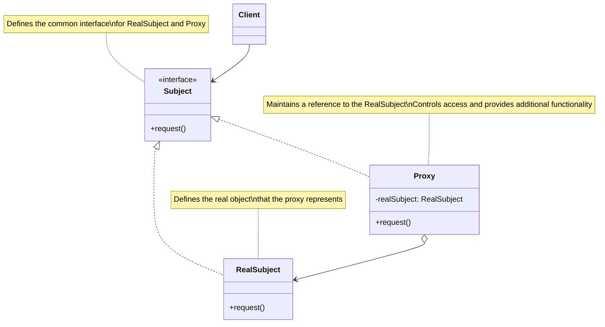
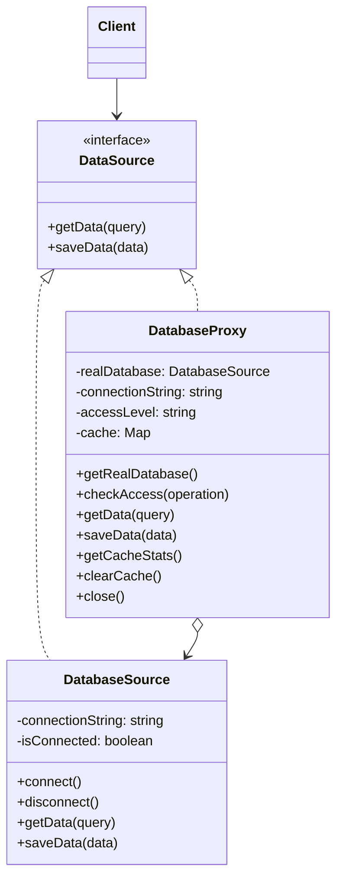

# Proxy Design Pattern

## Problem Statement

How do you control access to an object in a way that allows you to perform additional actions before or after accessing the original object? You might need to control access to an object for several reasons: the object might be expensive to create, require security checks, reside remotely, or need additional functionality like caching or logging. Directly exposing the object would not allow for these controls.

## ELI5

Imagine you have a famous friend who gets too many phone calls. Instead of giving everyone their direct number, they hire an assistant (the proxy). When someone wants to talk to your friend, they first talk to the assistant. The assistant can:

- Screen the calls (control access)
- Take messages when your friend is busy (delay creation)
- Remember common questions people ask (caching)
- Keep track of who's calling (logging)

The caller might think they're talking directly to your friend, but the assistant is managing the interaction. That's what a proxy does in programming - it stands in for another object and controls how that object is accessed.

## Solution Overview

The Proxy Design Pattern provides a surrogate or placeholder for another object to control access to it. It introduces a level of indirection when accessing an object, allowing the proxy to perform additional housekeeping tasks, control access, or defer operations when appropriate.

Key aspects of the pattern include:

1. **Same Interface**: The proxy implements the same interface as the original object (the subject)
2. **Reference to Subject**: The proxy maintains a reference to the subject
3. **Control Access**: The proxy controls access to the subject
4. **Additional Operations**: The proxy may perform additional operations before or after forwarding requests

### Flow Diagram

The following diagram in mermaid illustrates the Proxy pattern:



In our database example, the structure looks like:



### Structure

1. **Subject**: The `DataSource` interface declares common operations for both `DatabaseSource` and its proxy.

2. **Real Subject**: The `DatabaseSource` class implements the database operations and performs the actual work.

3. **Proxy**: The `DatabaseProxy` class implements the same interface and contains a reference to a `DatabaseSource` object, controls access to it, and adds functionality like caching and access control.

## Implementation Approach

### Flow

1. **Client request**: The client makes a request to the proxy
2. **Proxy pre-processing**: The proxy performs actions before forwarding the request (e.g., access control, caching check)
3. **Request delegation**: If necessary, the proxy forwards the request to the real subject
4. **Subject processing**: The real subject handles the request
5. **Proxy post-processing**: The proxy may perform additional actions after receiving the result (e.g., caching the result)
6. **Result return**: The proxy returns the result to the client

### Key Components

#### Subject Interface

```javascript
class DataSource {
  /**
   * Gets data from the source
   * @param {string} query - Query to find specific data
   * @returns {Promise<Object>} - The requested data
   */
  async getData(query) {
    throw new Error('getData method must be implemented by concrete classes');
  }

  /**
   * Saves data to the source
   * @param {Object} data - Data to save
   * @returns {Promise<boolean>} - Success status
   */
  async saveData(data) {
    throw new Error('saveData method must be implemented by concrete classes');
  }
}
```

#### Real Subject Implementation

```javascript
class DatabaseSource extends DataSource {
  constructor(connectionString) {
    super();
    this.connectionString = connectionString;
    this.isConnected = false;
  }

  async connect() {
    console.log(`Connecting to database at ${this.connectionString}...`);
    // Simulate connection delay
    await new Promise((resolve) => setTimeout(resolve, 1000));
    this.isConnected = true;
    console.log('Database connection established.');
  }

  async getData(query) {
    if (!this.isConnected) {
      await this.connect();
    }

    console.log(`Executing database query: ${query}`);
    // Simulate query execution
    await new Promise((resolve) => setTimeout(resolve, 500));

    // Return dummy data
    return {
      query,
      timestamp: new Date(),
      results: [
        { id: 1, name: 'Sample data 1' },
        { id: 2, name: 'Sample data 2' },
        { id: 3, name: 'Sample data 3' },
      ],
    };
  }
}
```

#### Proxy Implementation

```javascript
class DatabaseProxy extends DataSource {
  constructor(connectionString, accessLevel = 'read') {
    super();
    this.connectionString = connectionString;
    this.accessLevel = accessLevel;
    this.realDatabase = null;
    this.cache = new Map();
  }

  // Lazy initialization of real subject
  async getRealDatabase() {
    if (!this.realDatabase) {
      console.log('Proxy: Creating real database connection on first use.');
      this.realDatabase = new DatabaseSource(this.connectionString);
    }
    return this.realDatabase;
  }

  // Access control check
  checkAccess(operation) {
    if (operation === 'write' && this.accessLevel !== 'write') {
      console.log('Proxy: Write access denied. Current access level: ' + this.accessLevel);
      return false;
    }
    return true;
  }

  // Implement getData with caching
  async getData(query) {
    // Security check
    if (!this.checkAccess('read')) {
      throw new Error('Access denied');
    }

    // Check cache first
    if (this.cache.has(query)) {
      console.log(`Proxy: Cache hit for query "${query}". Using cached data.`);
      return this.cache.get(query);
    }

    console.log(`Proxy: Cache miss for query "${query}". Forwarding to real database.`);

    // Forward to real subject
    const database = await this.getRealDatabase();
    const result = await database.getData(query);

    // Cache the result
    this.cache.set(query, result);

    return result;
  }
}
```

## Considerations

### Performance Implications

- Adds a layer of indirection which can impact performance
- Can improve performance through caching and lazy loading
- May reduce network overhead by batching requests or implementing local caching
- Lazy initialization can defer expensive resource allocation until needed

### Security Considerations

- Provides a centralized place to implement access control
- Can log access attempts and enforce authentication
- Allows for request filtering and input validation
- May hide internal implementation details from client code

### Design Trade-offs

- Increases complexity by adding another layer
- May hide implementation details that advanced clients might need to know
- Can make code harder to debug by adding indirection
- Response times might be less predictable due to caching or lazy initialization

## When to Use

- **Virtual Proxy**: When creating an object is expensive and it might not be used immediately
- **Protection Proxy**: When you need to control access rights to the original object
- **Remote Proxy**: When the real object is in a different address space (e.g., on a remote server)
- **Caching Proxy**: When you need to cache results of expensive operations
- **Logging Proxy**: When you need to keep a history of requests to the original object
- **Smart Reference**: When you need to perform additional actions when an object is accessed

## When Not to Use

- When the added layer of indirection provides no real benefit
- When performance is critical and the proxy overhead is significant
- When the interface is simple and doesn't require additional control or functionality
- When the proxy would duplicate functionality that already exists in the system
- When direct access to the object is necessary for the system to function correctly

## Related Patterns or Examples

- **Adapter Pattern**: Unlike Proxy, Adapter provides a different interface to the wrapped object
- **Decorator Pattern**: Adds responsibilities to objects without changing their interface, but doesn't control access
- **Facade Pattern**: Simplifies a complex subsystem rather than controlling access to an object
- **Service Locator**: Can be used with Proxy to locate and access remote services
- **Lazy Loading**: A specific form of Virtual Proxy that defers object creation
