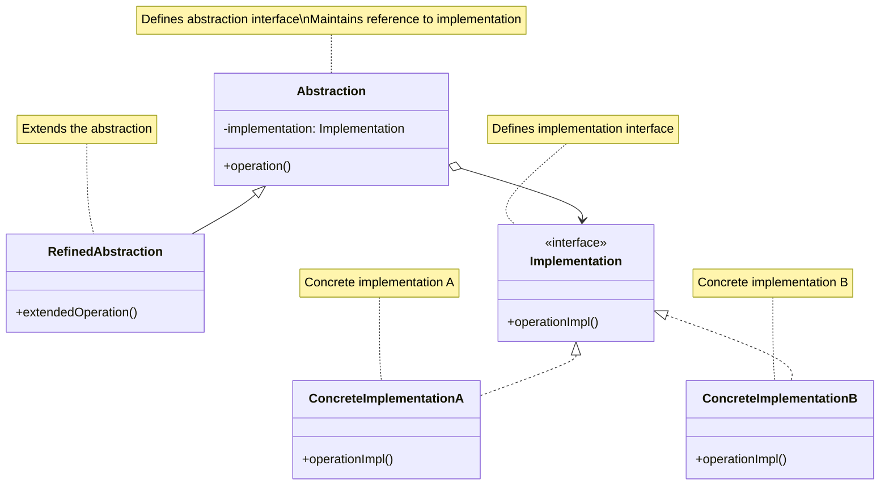
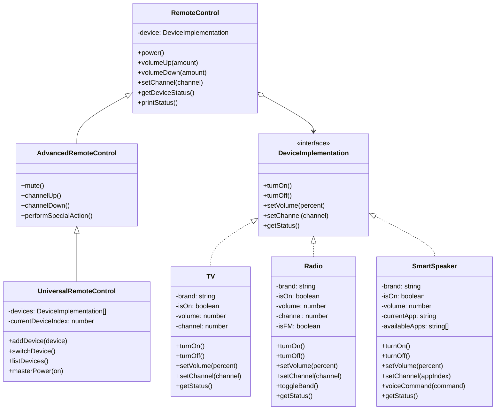

# Bridge Design Pattern

## Problem Statement

How do you separate an abstraction from its implementation so that both can evolve independently? When a class has multiple orthogonal dimensions of variation, inheritance can lead to an explosion of subclasses. Each new variation requires creating multiple new subclasses, making the class hierarchy complex and difficult to maintain.

## ELI5

Imagine you have different types of remote controls (basic, advanced, voice-activated) and different types of devices (TV, radio, smart speaker). If you tried to create a specific class for each combination (BasicTVRemote, AdvancedTVRemote, VoiceRadioRemote, etc.), you'd end up with lots of different classes.

Instead, you could have separate "remote control" classes and "device" classes, with the remote control using the device to perform operations. This way, any remote can work with any device, and you can add new remotes or devices without changing existing code.

The Bridge pattern works like this: instead of building a direct connection between two types of objects, you create a "bridge" that they can both use. This lets you change either side independently without affecting the other.

## Solution Overview

The Bridge Design Pattern separates an abstraction from its implementation so that both can vary independently. It involves an interface that acts as a bridge between the abstraction class and implementation classes, allowing them to develop and evolve separately without affecting each other.

Key components of the pattern include:

1. **Abstraction**: Defines the abstract interface and maintains a reference to the implementation
2. **Refined Abstraction**: Extends the abstraction with more specialized functionality
3. **Implementation**: Defines the interface for implementation classes
4. **Concrete Implementation**: Implements the Implementation interface

### Flow Diagram

The following diagram in mermaid illustrates the Bridge pattern:



In our device remote control example, the structure looks like:



### Structure

1. **Abstraction**: The `RemoteControl` class defines the interface for controlling devices and delegates the actual work to the device implementation.

2. **Refined Abstractions**:

   - `AdvancedRemoteControl` extends the basic functionality with additional operations
   - `UniversalRemoteControl` further extends it to manage multiple devices

3. **Implementation Interface**: The `DeviceImplementation` interface defines the common methods all devices must implement.

4. **Concrete Implementations**:
   - `TV` implements device-specific functionality for televisions
   - `Radio` implements device-specific functionality for radios
   - `SmartSpeaker` implements device-specific functionality for smart speakers

## Implementation Approach

### Flow

1. **Define the Implementation interface** that concrete implementations will follow
2. **Implement concrete implementation classes** for each platform/system variant
3. **Create the Abstraction class** that references and uses the Implementation interface
4. **Define Refined Abstraction classes** that extend the base abstraction with additional operations
5. **Client code works with Abstraction**, while the abstraction delegates platform-specific work to Implementation

### Key Components

#### Implementation Interface

```javascript
class DeviceImplementation {
  /**
   * Power on the device
   */
  turnOn() {
    throw new Error('turnOn method must be implemented by concrete classes');
  }

  /**
   * Power off the device
   */
  turnOff() {
    throw new Error('turnOff method must be implemented by concrete classes');
  }

  // Other device operations...
}
```

#### Concrete Implementation

```javascript
class TV extends DeviceImplementation {
  constructor(brand = 'Generic') {
    super();
    this.brand = brand;
    this.isOn = false;
    this.volume = 30;
    this.channel = 1;
  }

  turnOn() {
    this.isOn = true;
    console.log(`${this.brand} TV is now ON`);
  }

  // Other device-specific implementations...
}
```

#### Abstraction

```javascript
class RemoteControl {
  /**
   * Create a new remote control for a specific device
   * @param {DeviceImplementation} device - The device to control
   */
  constructor(device) {
    this.device = device;
  }

  /**
   * Power the device on/off
   */
  power() {
    if (this.device.getStatus().powerStatus === 'ON') {
      this.device.turnOff();
    } else {
      this.device.turnOn();
    }
  }

  // Other remote operations that delegate to the device...
}
```

#### Refined Abstraction

```javascript
class AdvancedRemoteControl extends RemoteControl {
  /**
   * Mute the device
   */
  mute() {
    const status = this.device.getStatus();
    console.log(`Setting ${status.deviceType} to mute`);
    this.device.setVolume(0);
  }

  // Additional operations...
}
```

## Considerations

### Performance Implications

- Adds a layer of indirection which may have a minimal impact on performance
- Increases memory usage slightly due to the additional objects
- Generally, the flexibility benefits outweigh the minor performance costs

### Design Flexibility

- Decouples abstraction from implementation, allowing both to vary independently
- Makes it easy to extend the system with new abstractions or implementations
- Allows changing implementations at runtime
- Hides implementation details from clients

### When to Refactor

- When you notice an explosion of subclasses to handle multiple orthogonal variations
- When you want to avoid permanent binding between an abstraction and its implementation
- When changes in the implementation should not impact client code
- When you need to support multiple platforms without duplicating higher-level code

## When to Use

- When you want to avoid a permanent binding between an abstraction and its implementation
- When both the abstraction and its implementation should be extensible through inheritance
- When changes in the implementation should not impact the client code
- When you have multiple orthogonal dimensions of variation
- When you want to share an implementation among multiple objects and hide this fact from the client

## When Not to Use

- When there is only one implementation and no plans for more
- When the abstraction and implementation don't need to vary independently
- When simplicity is more important than flexibility
- When performance is critical and the additional indirection would impact it significantly
- When the relationship between abstraction and implementation is fixed and simple

## Related Patterns or Examples

- **Adapter Pattern**: Adapts one interface to another, while Bridge separates an interface from its implementation
- **Strategy Pattern**: Like Bridge, allows changing implementation at runtime, but focuses on algorithms rather than abstractions/implementations
- **Abstract Factory**: Can be used with Bridge to create the implementation objects
- **Composite Pattern**: Can be combined with Bridge when the abstractions need to form hierarchical structures
- **Decorator Pattern**: Similar structure but with a different intent - decorating objects with additional behavior vs. separating abstraction from implementation
