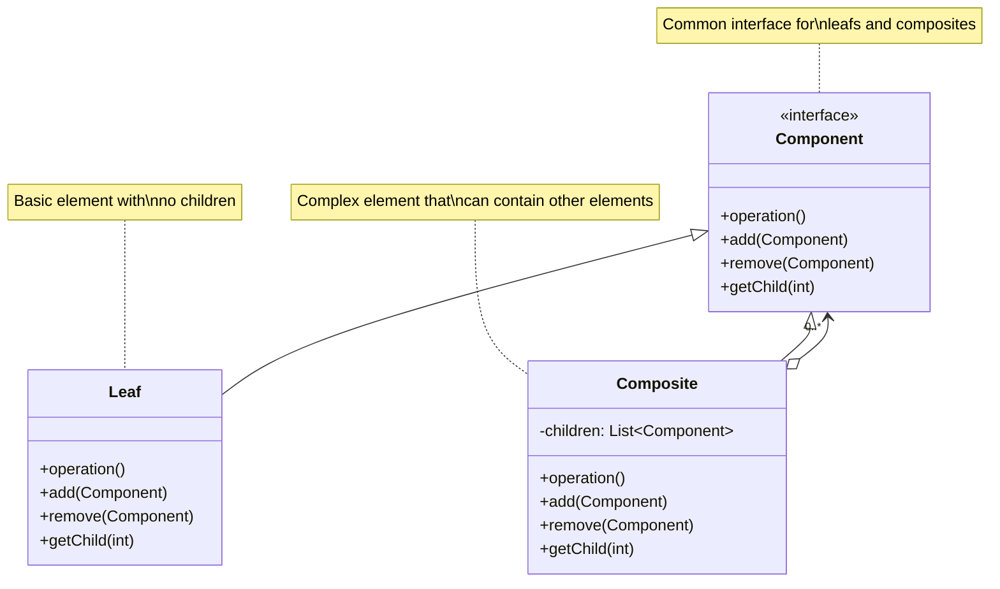
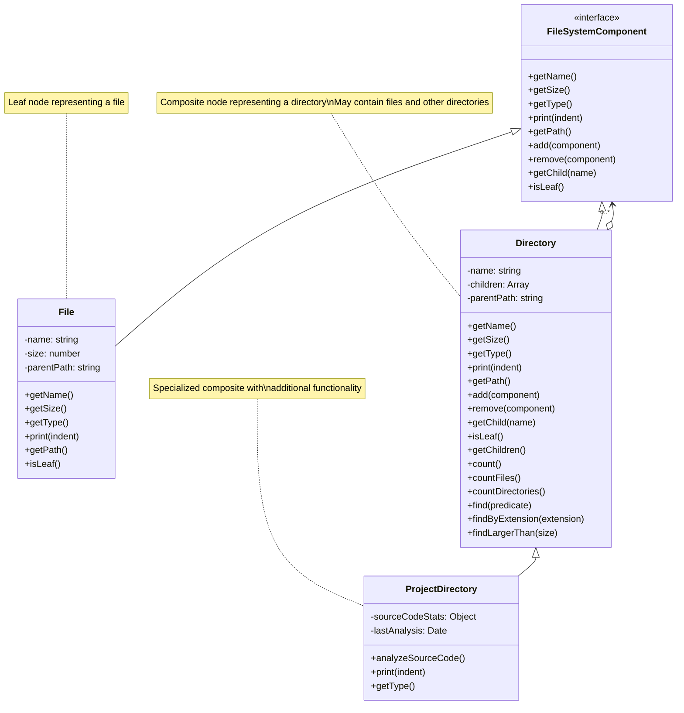

# Composite Design Pattern

## Problem Statement

How do you design a structure that allows clients to treat individual objects and compositions of objects uniformly? In many systems, client code needs to work with both simple leaf objects and complex composites of objects. The differences in interacting with these two types of objects can lead to complex and error-prone client code that has to use conditional logic to distinguish between them.

## ELI5

Imagine you have a box of toys. Some toys are simple, like a ball or a car. But some toys are actually containers, like a toy chest or a dollhouse, which can contain other toys, including more containers.

If you want to count all your toys, you'd have to:

1. Count each simple toy as one
2. For containers, look inside and count all the toys within, including any containers inside them

The Composite pattern works the same way: it lets you treat both simple objects (like a single toy) and complex objects (like a container of toys) the same way. You can tell both "give me your count" and they'll do the right thing, without you having to know if it's a simple toy or a container.

## Solution Overview

The Composite Design Pattern composes objects into tree structures to represent part-whole hierarchies. It lets clients treat individual objects and compositions of objects uniformly. The pattern defines a common component interface that both simple elements (leaves) and complex elements (composites) implement, allowing clients to work with all elements in the same way.

Key components of the pattern include:

1. **Component**: The common interface for all objects in the composition
2. **Leaf**: A basic element with no sub-elements
3. **Composite**: An element that can contain other elements (both leaves and other composites)
4. **Client**: Works with elements through the component interface

### Flow Diagram

The following diagram in mermaid illustrates the Composite pattern:



In our file system example, the structure looks like:



### Structure

1. **Component**: The `FileSystemComponent` interface declares common operations for both simple and complex elements.

2. **Leaf**: The `File` class represents a leaf node in the structure - it has no children and implements all operations defined in the component interface.

3. **Composite**: The `Directory` class represents a composite node that can contain other components (files or subdirectories). It implements the component interface and manages child components.

4. **Specialized Composite**: The `ProjectDirectory` class extends the basic composite functionality with domain-specific operations.

## Implementation Approach

### Flow

1. **Define a common Component interface** that all elements will implement
2. **Create Leaf classes** that implement the Component interface for atomic elements
3. **Create Composite classes** that implement the Component interface for complex elements
4. **Implement child management** in Composite classes (add, remove, get children)
5. **Recursively delegate** operations from Composite to children as needed

### Key Components

#### Component Interface

```javascript
class FileSystemComponent {
  /**
   * Returns the name of the component
   * @returns {string} Component name
   */
  getName() {
    throw new Error('getName method must be implemented by concrete classes');
  }

  /**
   * Returns the size of the component
   * @returns {number} Size in bytes
   */
  getSize() {
    throw new Error('getSize method must be implemented by concrete classes');
  }

  /**
   * Adds a child component (only works for composites)
   * @param {FileSystemComponent} component - The component to add
   */
  add(component) {
    throw new Error('Operation not supported');
  }

  // Other common methods...
}
```

#### Leaf Implementation

```javascript
class File extends FileSystemComponent {
  constructor(name, size, parentPath = '') {
    super();
    this.name = name;
    this.size = size;
    this.parentPath = parentPath;
  }

  getName() {
    return this.name;
  }

  getSize() {
    return this.size;
  }

  // Other methods...

  // Leaf-specific behavior
  isLeaf() {
    return true;
  }
}
```

#### Composite Implementation

```javascript
class Directory extends FileSystemComponent {
  constructor(name, parentPath = '') {
    super();
    this.name = name;
    this.children = [];
    this.parentPath = parentPath;
  }

  getName() {
    return this.name;
  }

  // Composite operation that recursively calculates size
  getSize() {
    return this.children.reduce((total, child) => total + child.getSize(), 0);
  }

  // Child management operations
  add(component) {
    component.parentPath = this.getPath();
    this.children.push(component);
    return component;
  }

  remove(component) {
    const index = this.children.indexOf(component);
    if (index !== -1) {
      this.children.splice(index, 1);
    }
  }

  getChild(name) {
    return this.children.find((child) => child.getName() === name) || null;
  }

  // Composite-specific behavior
  isLeaf() {
    return false;
  }

  // Other methods...
}
```

## Considerations

### Performance Implications

- Recursion in composite operations can impact performance for deep hierarchies
- Caching results of expensive operations can improve performance
- Memory usage increases with the size and depth of the structure
- Consider lazy loading for large structures

### Design Flexibility

- Makes it easy to add new component types without changing client code
- Simplifies client code by eliminating type checking and conditional logic
- Allows building complex hierarchies from simple building blocks
- Supports recursive operations on the entire structure

### Implementation Challenges

- May require careful handling of operations not applicable to all components
- Can lead to overly general interfaces that don't make sense for all components
- Child management operations in leaf nodes require special handling
- Maintaining parent references can complicate object removal

## When to Use

- When you want to represent part-whole hierarchies of objects
- When you want clients to be able to ignore the differences between compositions and individual objects
- When the structure can naturally be represented as a tree
- When operations need to be performed recursively on both simple and composite objects
- When you want to add new component types without changing existing code

## When Not to Use

- When the hierarchy doesn't have a clear tree structure
- When you need to work with fundamentally different behaviors for leaf and composite objects
- When performance is critical and recursive operations would be too costly
- When the component interface would become too general to be meaningful
- When you need specific operations for each type of component

## Related Patterns or Examples

- **Decorator Pattern**: Adds responsibilities to objects without changing their interface, often used with Composite
- **Iterator Pattern**: Provides a way to access the elements of a composite sequentially without exposing its structure
- **Visitor Pattern**: Separates algorithms from the objects on which they operate, often used to perform operations on composites
- **Flyweight Pattern**: Can be used to share leaf components to reduce memory usage
- **Chain of Responsibility**: Can be implemented using a composite structure where components handle requests or pass them to parents
