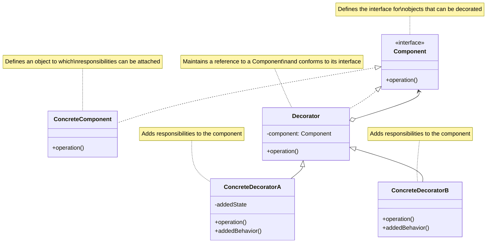
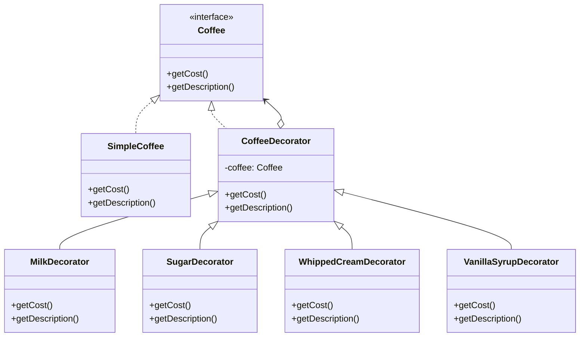

# Decorator Design Pattern

## Problem Statement

How do you add new functionalities to an object dynamically without affecting the behavior of other objects from the same class? Inheritance is one solution, but it can lead to a complex and rigid class hierarchy, especially when you need many different combinations of features. Additionally, some languages limit classes to single inheritance, further constraining this approach.

## ELI5

Imagine you're at an ice cream shop. You start with a basic ice cream, and then you can add toppings like sprinkles, chocolate sauce, nuts, or whipped cream. Each topping "decorates" your ice cream, adding something new without changing the fact that it's still an ice cream underneath. You can add as many toppings as you want, in any order, and still have an ice cream at the end - just a fancier one!

The Decorator pattern works the same way: you start with a basic object (like your ice cream) and then wrap it with decorator objects (like your toppings) that add new behaviors or modify existing ones.

## Solution Overview

The Decorator Design Pattern lets you attach new behaviors to objects by placing these objects inside special wrapper objects that contain the behaviors. The pattern uses composition instead of inheritance to extend functionality, giving more flexibility at runtime.

Key components of the pattern include:

1. **Component Interface**: Defines the interface for objects that can have responsibilities added to them
2. **Concrete Component**: The basic object that we want to add functionality to
3. **Decorator**: Abstract class that implements the Component interface and has a reference to a Component object
4. **Concrete Decorators**: Add specific functionality to the component

### Flow Diagram

The following diagram in mermaid illustrates the Decorator pattern:



In our coffee example, the structure looks like:



### Structure

1. **Component**: The `Coffee` interface declares the common interface for both the core object and its decorators.

2. **Concrete Component**: The `SimpleCoffee` class implements the base functionality.

3. **Base Decorator**: The `CoffeeDecorator` abstract class maintains a reference to a wrapped object and forwards requests to it.

4. **Concrete Decorators**: Classes like `MilkDecorator`, `SugarDecorator`, etc., extend the functionality by adding new behavior before or after forwarding requests to the wrapped object.

## Implementation Approach

### Flow

1. **Create a base component interface** that defines the methods for all concrete components and decorators
2. **Implement the concrete component** that provides the basic functionality
3. **Create a base decorator** that implements the component interface and holds a reference to a component
4. **Implement concrete decorators** that extend the base decorator and add specific behaviors
5. **Compose objects** by wrapping components with one or more decorators

### Key Components

#### Component Interface

```javascript
class Coffee {
  getCost() {
    throw new Error('getCost method must be implemented by concrete classes');
  }

  getDescription() {
    throw new Error('getDescription method must be implemented by concrete classes');
  }
}
```

#### Concrete Component

```javascript
class SimpleCoffee extends Coffee {
  getCost() {
    return 2.0; // Base cost of simple coffee
  }

  getDescription() {
    return 'Simple coffee';
  }
}
```

#### Base Decorator

```javascript
class CoffeeDecorator extends Coffee {
  constructor(coffee) {
    super();
    this.coffee = coffee;
  }

  getCost() {
    return this.coffee.getCost(); // Delegates to wrapped object
  }

  getDescription() {
    return this.coffee.getDescription(); // Delegates to wrapped object
  }
}
```

#### Concrete Decorator

```javascript
class MilkDecorator extends CoffeeDecorator {
  getCost() {
    return this.coffee.getCost() + 0.5; // Add $0.50 for milk
  }

  getDescription() {
    return `${this.coffee.getDescription()}, with milk`;
  }
}
```

## Considerations

### Performance Implications

- Adds some overhead due to the additional layers of indirection
- The number of small objects in the system increases, which may impact memory usage
- Method calls may go through several levels of delegation, which can affect performance in deep decorator stacks

### Maintainability

- Provides more flexibility than static inheritance
- Follows the Single Responsibility Principle by separating concerns into different classes
- Can lead to many small objects that differ only in the way they are connected
- Deep decorator stacks can be hard to debug and understand

### Design Flexibility

- Allows extending an object's behavior without making a new subclass
- Lets you combine behaviors by wrapping an object with multiple decorators
- Allows adding or removing responsibilities at runtime
- Enables creating complex combinations from simple components

## When to Use

- When you need to add responsibilities to objects dynamically and transparently
- When extension by subclassing is impractical due to a large number of possible combinations
- When you want to add functionality to individual objects without affecting others
- When you need to be able to withdraw the added functionality later
- When modifying the existing code is not possible or not desirable

## When Not to Use

- When you need to add functionality to an entire class of objects
- When the component structure is stable and unlikely to change
- When the number of possible combinations is small and fixed
- When the additional flexibility doesn't justify the increased complexity
- When the system is performance-critical and the overhead of multiple wrappers would be problematic

## Related Patterns or Examples

- **Composite Pattern**: Decorators can be viewed as a degenerate composite with only one component
- **Strategy Pattern**: Decorators change the skin of an object, strategies change the guts
- **Adapter Pattern**: Decorator changes an object's responsibilities, Adapter changes its interface
- **Chain of Responsibility**: Both patterns rely on recursive composition, but Decorator adds responsibilities while Chain of Responsibility assigns responsibility to one of many possible handlers
- **Proxy Pattern**: Proxy controls access to an object, while Decorator adds responsibilities to an object
