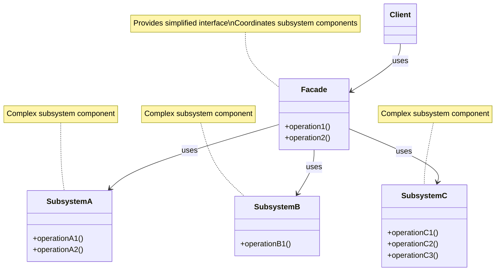
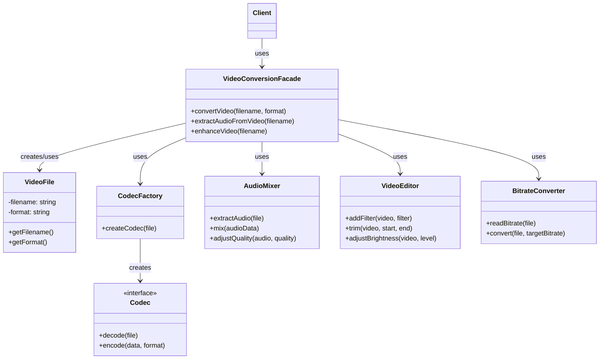

# Facade Design Pattern

## Problem Statement

How do you provide a simple interface to a complex subsystem without hiding its functionality? Complex subsystems often evolve to contain many classes with intricate interdependencies. Using the subsystem requires understanding these details, initializing objects in the right order, and following specific workflows. This complexity makes client code tightly coupled to implementation details and hard to maintain.

## ELI5

Imagine you want to watch a movie. There are many complicated steps involved: turning on the TV, selecting the right input source, turning on the sound system, finding the streaming app, searching for the movie, etc. Instead of doing all these steps yourself, you could use a "Watch Movie" button on a universal remote control. You press one button, and it takes care of all those complicated steps for you.

The Facade pattern works the same way: it provides a simple "button" (interface) that handles all the complicated steps needed to work with a complex system, so you don't have to worry about the details.

## Solution Overview

The Facade Design Pattern provides a unified interface to a set of interfaces in a subsystem. It defines a higher-level interface that makes the subsystem easier to use by reducing complexity and hiding the communication and dependencies between subsystems.

Key aspects of the pattern include:

1. **Simplification**: Provides a simple interface to a complex subsystem
2. **Decoupling**: Reduces dependencies between client code and subsystem components
3. **Layering**: Creates a separation between clients and the subsystem
4. **Access Control**: Can limit which parts of the subsystem are accessible

### Flow Diagram

The following diagram in mermaid illustrates the Facade pattern:



In our video conversion example, the structure looks like:



### Structure

1. **Facade**: `VideoConversionFacade` provides simplified methods for common video operations by coordinating the subsystem components.

2. **Subsystem Components**: Classes like `VideoFile`, `Codec`, `AudioMixer`, `BitrateConverter`, and `VideoEditor` that perform specific parts of video processing.

3. **Client**: Code that uses the facade to interact with the subsystem in a simplified way.

## Implementation Approach

### Flow

1. **Identify the complex subsystem** and its components
2. **Create a facade class** that provides simplified methods for common operations
3. **Implement facade methods** that coordinate subsystem components
4. **Client code uses the facade** instead of accessing subsystem components directly

### Key Components

#### Facade Class

```javascript
class VideoConversionFacade {
  /**
   * Converts video from one format to another
   * @param {string} filename - Input video filename
   * @param {string} targetFormat - Target format
   * @returns {string} - Converted video file information
   */
  convertVideo(filename, targetFormat) {
    console.log(`\nVideoConversionFacade: Starting conversion of ${filename} to ${targetFormat}`);

    // Create subsystem components
    const file = new VideoFile(filename);
    const codecFactory = new CodecFactory();
    const sourceCodec = codecFactory.createCodec(file);

    // If the target format is different from the source, we need a target codec
    let targetCodec;
    if (file.getFormat() !== targetFormat) {
      targetCodec = codecFactory.createCodec(new VideoFile(`dummy.${targetFormat}`));
    } else {
      targetCodec = sourceCodec;
    }

    // Use subsystem components to perform complex operations
    const decodedVideoData = sourceCodec.decode(file);

    const audioMixer = new AudioMixer();
    const audioData = audioMixer.extractAudio(file);
    const processedAudio = audioMixer.adjustQuality(audioData, 90);

    const videoEditor = new VideoEditor();
    let editedVideo = decodedVideoData;
    editedVideo = videoEditor.addFilter(editedVideo, 'Auto-color correction');
    editedVideo = videoEditor.adjustBrightness(editedVideo, 5);

    const bitrateConverter = new BitrateConverter();
    const convertedVideo = bitrateConverter.convert(file, 8);

    const encodedVideo = targetCodec.encode(editedVideo, targetFormat);

    // Return simplified result to client
    const outputFilename = `${filename.substring(0, filename.lastIndexOf('.'))}.${targetFormat}`;
    console.log(`\nVideoConversionFacade: Conversion completed - ${outputFilename}`);

    return outputFilename;
  }

  // Additional simplified methods...
}
```

#### Subsystem Components

```javascript
class CodecFactory {
  /**
   * Creates the appropriate codec for a video file
   * @param {VideoFile} file - The video file
   * @returns {Codec} - The appropriate codec
   */
  createCodec(file) {
    const format = file.getFormat();
    console.log(`Creating codec for ${format} format`);

    switch (format) {
      case 'mp4':
        return new MPEG4Codec();
      case 'avi':
        return new AVICodec();
      // Other formats...
      default:
        return new OGGCodec();
    }
  }
}
```

#### Client Usage

```javascript
// Client code - simple and focused on business needs
function clientCode() {
  // Create the facade
  const converter = new VideoConversionFacade();

  // Use simplified interface
  const mp4Result = converter.convertVideo('wildlife.avi', 'mp4');
  console.log(`CLIENT: Great! I now have a converted file: ${mp4Result}\n`);

  // Extract audio with one simple call
  const audioResult = converter.extractAudioFromVideo('vacation.mkv');
  console.log(`CLIENT: Perfect! I now have the audio track: ${audioResult}\n`);
}
```

## Considerations

### Performance Implications

- May introduce some overhead by adding an extra layer between clients and subsystem
- Simplifies complex operations that might otherwise be implemented inefficiently by clients
- Can implement caching to optimize repeated operations

### Maintainability

- Isolates client code from subsystem changes
- Centralizes complex workflows in one place
- Makes subsystem easier to understand and use
- May grow into a "god object" if not careful

### Flexibility

- Doesn't prevent access to subsystem components when advanced operations are needed
- Can provide different facade variants for different client needs
- Decouples client code from implementation details

## When to Use

- When you want to provide a simple interface to a complex subsystem
- When there are many dependencies between clients and implementation classes
- When you want to layer your subsystems and provide entry points at each layer
- When you need to reduce coupling between client code and subsystems
- When you want to make a library or framework easier to understand and use

## When Not to Use

- When simplicity isn't needed or the existing interfaces are already simple
- When you want to prevent clients from accessing subsystem components (use Abstraction instead)
- When adding another layer would unnecessarily complicate the system
- When performance is critical and the overhead of an additional layer is a concern

## Related Patterns or Examples

- **Adapter Pattern**: Facade changes an interface to simplify it, while Adapter changes an interface to match what clients expect
- **Mediator Pattern**: Similar to Facade, but focuses on coordinating between objects rather than simplifying a subsystem
- **Singleton Pattern**: A Facade is often implemented as a Singleton
- **Abstract Factory Pattern**: Can be used within a Facade to create subsystem objects
- **Composite Pattern**: Often used with Facade to represent hierarchical structures in the subsystem
